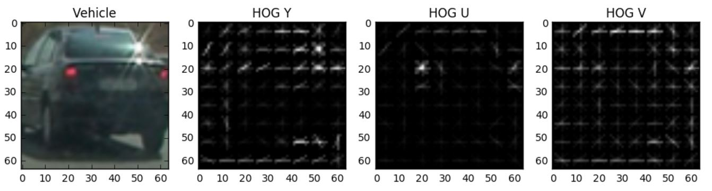
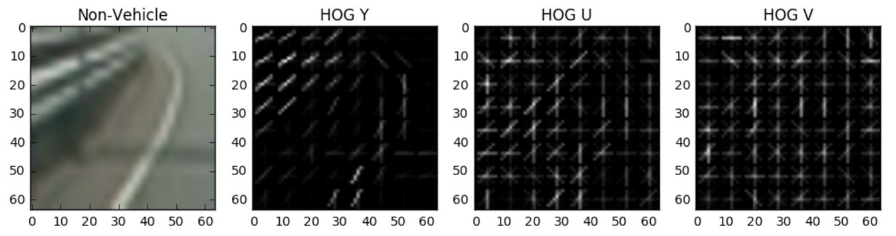
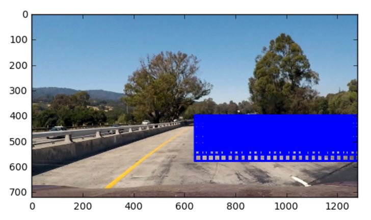
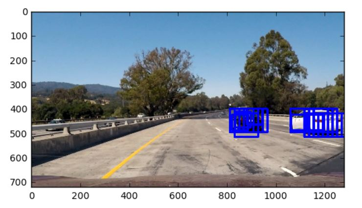
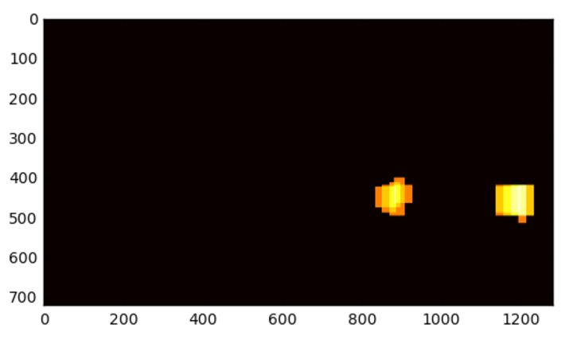
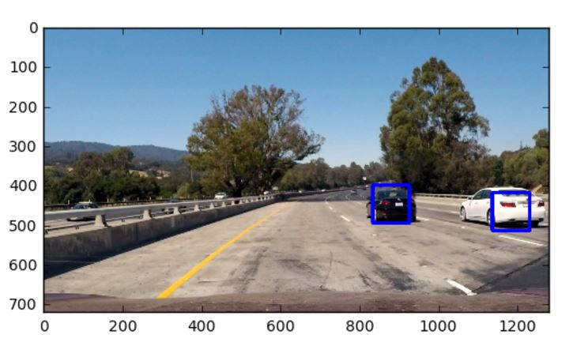

## Vehicle Detection

The goals / steps of this project are the following:

* Perform a Histogram of Oriented Gradients (HOG) feature extraction on a labeled training set of images and train a classifier Linear SVM classifier
* Optionally, you can also apply a color transform and append binned color features, as well as histograms of color, to your HOG feature vector. 
* Note: for those first two steps don't forget to normalize your features and randomize a selection for training and testing.
* Implement a sliding-window technique and use your trained classifier to search for vehicles in images.
* Run your pipeline on a video stream (start with the test_video.mp4 and later implement on full project_video.mp4) and create a heat map of recurring detections frame by frame to reject outliers and follow detected vehicles.
* Estimate a bounding box for vehicles detected.

Here are links to the labeled data for [vehicle](https://s3.amazonaws.com/udacity-sdc/Vehicle_Tracking/vehicles.zip) and [non-vehicle](https://s3.amazonaws.com/udacity-sdc/Vehicle_Tracking/non-vehicles.zip) examples to train your classifier.  These example images come from a combination of the [GTI vehicle image database](http://www.gti.ssr.upm.es/data/Vehicle_database.html), the [KITTI vision benchmark suite](http://www.cvlibs.net/datasets/kitti/), and examples extracted from the project video itself.   You are welcome and encouraged to take advantage of the recently released [Udacity labeled dataset](https://github.com/udacity/self-driving-car/tree/master/annotations) to augment your training data.  

Example of Vehicle data:-

#Hog
Here I have used skimage's hog method. This has been implemented in `hog_features` function in third cell of jupyter notebook(CarND-Vehicle-Detection.ipynb).
I tried various permutations and combinations and got high accuracy for YUV color space with orientation=8,pixels per cell = 8
and cells per block = 2.
I have taken hog of each channel and then concatenated them.

Example of Non-Vehicel data:-

#Classifier
The HOG features extracted from the training data using the `derive_features` function in cell four.Then I normalized the data using sklearn.preprocessing's `StandardScaler`.This has been implemented in cell 10.
After normailzing I split my data into training and test using `train_test_split` of sklearn.model_selection.
I have used Linear SVM as classifier. We attained accuracy of 98.5%.

#Sliding Window Search
To identify vehicles in an image, we will use a sliding windows approach to detect vehicles.So for this we have created `slide_window` function(cell 17) which will provide us windows in which we have to search for the car.Here I have chosen the right bottom half of the image as Region Of Interset.Here multiples windows are selected viz.(64, 64), (96, 96), (128, 128). I have constant overlap of 0.8 for all of them.
This is what we get after `slide_window` function:-

After this we iterate through each window and try to find a car in it. We do this by resizing the window to 64X64, extract its hog features,normalize them and then pass through classifier.To eliminate some false postive we set some threshold for the confidence value. Code can be found in `search_windows` function in cell 18.
This is what we get after applying threshold:-

We have used HeatMap technique to reduce the false positives, code for which can be found in cell 20. 
After applying heatmap, we get drastic improvement and our pipelines detects the car. We have got `draw_boxes` function in cell 16 which helps us in draw bounding boxes around high-confidence detections where multiple overlapping detections occur.

HeatMap visualization:-

#Pipeline
For video I have created `VehilceDetector` class. Here we maintain heatmaps of past n number of frames, which helps us in averaging and getting smoothening effect.

[Watch](https://www.youtube.com/watch?v=d49HwGTXhgw) output video.

Also I have combined third project with this one. You can [watch](https://www.youtube.com/watch?v=dSp0ku_ZokE) it here.

#Reflection:
I found this approach very crude. It took 30 min for my pipeline to work on whole project video. This happens because we iterate throgh large number of windowss of varying size. Also there should be some non-linearity in classifier so that it is robust and accuracy increases.We can implement YOLO and other deep learning techniques to improve the performance.
